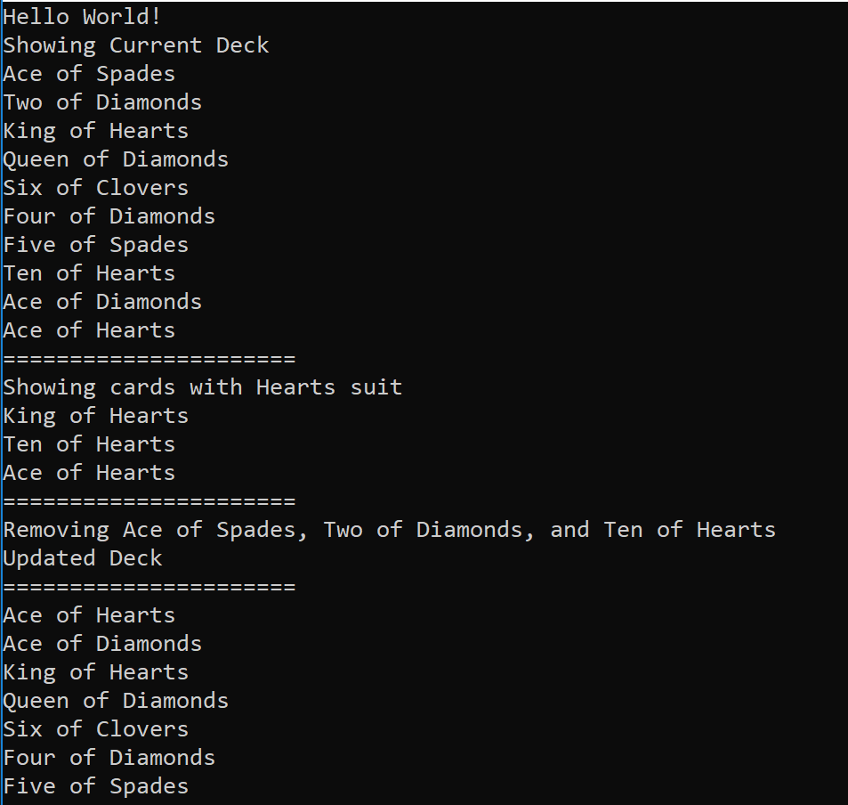

# Lab 7 Collections

This is a simple console app that has Deck and Card classes. Users are able to select cards of same suit, add cards. and remove cards at will.

## Getting Started

Open the project with Visual Studio, and run (Ctrl + F5). 

Alternatively, you can navigate to project directory containing Program.cs file with PowerShell, then do the following.

 ```
 dotnet run
 ```

 ## Visual

 